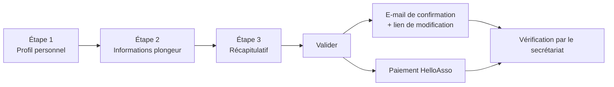

# Adhérer au club : mode d'emploi du formulaire d'adhésion

Ce document explique, **du point de vue de l'adhérent**, comment remplir le formulaire d'adhésion du club : ce qu'il faut préparer, ce qu'il faut faire, ce qu'il ne faut pas faire, et ce que signifie chaque message affiché par le site.

Il ne traite pas du travail de validation réalisé ensuite par le secrétariat.

---

## 1. Avant de commencer

Préparez ces éléments : le formulaire se remplit en quelques minutes si tout est sous la main.

| À préparer | Détail | Obligatoire |
| --- | --- | --- |
| **Votre carte de licence FFESSM** | Le QR code de la carte remplit automatiquement une grande partie du formulaire | Non, mais fortement conseillé |
| **Une photo d'identité** | Fichier **JPEG ou PNG**, **moins de 2 Mo** | Non |
| **Votre CACI** | Certificat médical signé par un médecin. Fichier **JPEG, PNG ou PDF**, **moins de 2 Mo** | Non au moment de la saisie, mais **indispensable** pour que l'adhésion soit validée |
| **La date de fin de validité du CACI** | Celle inscrite sur le certificat | Oui, en pratique (voir §5) |
| **Une adresse e-mail valide** | Elle sert à vous envoyer la confirmation **et le lien pour modifier votre dossier** | Oui |
| **Le nom et le téléphone d'une personne à prévenir** | En cas d'urgence pendant une activité | Oui |

> **À ne pas faire** : utiliser une adresse e-mail déjà utilisée par un autre adhérent (celle de votre conjoint, par exemple). Chaque adhérent doit avoir la sienne, sinon le site refuse l'adhésion.

---

## 2. Accéder au formulaire

Trois situations, trois façons d'arriver sur le formulaire.

| Votre situation | Ce que vous faites | Ce qui se passe |
| --- | --- | --- |
| **Première adhésion** | Vous ouvrez la page d'adhésion du site, sans être connecté | Le formulaire est vide, un compte sera créé à la validation |
| **Renouvellement** | Vous vous **connectez d'abord** avec votre numéro de licence, puis vous ouvrez la page d'adhésion | Le formulaire est déjà rempli avec vos informations |
| **Reprendre un dossier commencé** | Vous cliquez sur le lien reçu par e-mail après votre première validation | Le formulaire est rechargé avec ce que vous aviez saisi |

**Si le site affiche « Aucune campagne de type *Saison* n'est ouverte, vous ne pouvez pas vous inscrire pour le moment »**, c'est que les adhésions ne sont pas encore ouvertes (ou sont closes). Vous êtes redirigé vers une page d'information. Il n'y a rien à faire : revenez à la date annoncée par le club.

> **À faire** : si vous avez déjà été adhérent, **connectez-vous avant** de remplir le formulaire. C'est la seule façon de rattacher votre nouvelle adhésion à votre dossier existant (brevets, historique, profil).
>
> **À ne pas faire** : refaire une « nouvelle adhésion » alors que vous avez déjà un compte. Le site la refusera (voir les messages « Numéro de licence déjà utilisé » et « Adresse e-mail déjà utilisée » au §8).

---

## 3. Le parcours en trois étapes

Vous naviguez avec les onglets en haut de page ou avec les boutons **Précédent / Suivant** en bas de page. Les deux font exactement la même chose.

**Règles de navigation à connaître :**

- Le site **vérifie l'étape que vous quittez**. Si un champ obligatoire est vide ou mal rempli, le passage est bloqué et une fenêtre « Formulaire incomplet » s'affiche.
- Les champs en faute sont **encadrés en rouge**. Les champs corrects passent en **vert**.
- Vous pouvez revenir en arrière librement : rien n'est perdu tant que vous ne rechargez pas la page.
- Le bouton **Valider** n'apparaît qu'à l'étape 3.

> **À ne pas faire** : recharger la page (F5) ou fermer l'onglet en cours de saisie. Tant que vous n'avez pas validé, **rien n'est enregistré**.

---

## 4. Étape 1 — Profil personnel

### Les champs

| Champ | Obligatoire | Format attendu |
| --- | --- | --- |
| Civilité | Oui | Mme / M. / Mlle |
| Prénom, Nom | Oui | Texte libre |
| Adresse | Oui | Ex. `25 avenue Ampère` |
| Code postal | Oui | **5 chiffres**, ex. `91000` |
| Ville | Oui | Texte libre |
| Né le | Oui | **jj/mm/aaaa**, ex. `14/03/1985` |
| Téléphone | Oui | Numéro français : `0612345678`, `+33 6 12 34 56 78`, points ou tirets acceptés |
| Mail | Oui | Adresse valide et **unique** dans le club |
| Personne à prévenir (nom, téléphone) | Oui | Mêmes formats que ci-dessus |
| Droit à l'image | — | Interrupteur, sur « Oui » par défaut |
| Photo d'identité | Non | JPEG ou PNG, moins de 2 Mo |

### La photo

Deux façons de la charger : **glisser-déposer** le fichier sur la zone prévue, ou **cliquer sur l'image** pour choisir un fichier.

> **À faire** : une photo de type photo d'identité, cadrée sur le visage. Elle apparaît dans le trombinoscope et sur votre fiche.
>
> **À ne pas faire** : déposer un fichier de plusieurs mégaoctets sorti de l'appareil photo, ou un format exotique (HEIC, BMP, TIFF…). Le site les refuse — voir « Fichier invalide » au §8.

### Le code postal et la date de naissance comptent

Ces deux champs ne sont pas de simples informations : ils **déterminent le montant de votre cotisation** (tarif Val d'Yerres ou hors agglomération, tarif enfant ou adulte), calculé à l'étape 3.

> **À faire** : vérifiez-les avant de continuer. Une erreur ici fausse le montant affiché et le tarif à choisir sur HelloAsso.

### Le droit à l'image

L'interrupteur est sur **Oui** par défaut. Basculez-le sur **Non** si vous ne souhaitez pas que vos photos ou vidéos soient utilisées pour la communication du club. Votre choix est rappelé dans le récapitulatif.

---

## 5. Étape 2 — Informations plongeur

### Le plus rapide : scanner sa carte de licence

Le bouton **« Scanner le QR Code de la licence FFESSM »** (en haut de page, étapes 1 et 2) ouvre la caméra. Visez le QR code de votre carte.

Le site vous demande alors confirmation : *« Reprendre les informations de … et ses N brevet(s) dans le formulaire ? »*. Si vous confirmez, il remplit **civilité, nom, prénom, numéro de licence, date de fin de validité de la licence** et **tous vos brevets**.

> **Attention** : les informations déjà saisies dans ces champs sont **remplacées**, et **la liste des brevets est entièrement remplacée**. C'est annoncé dans la fenêtre de confirmation.
>
> **À faire** : scanner **au début** de la saisie de l'étape 2, avant d'ajouter des brevets à la main.
>
> **À ne pas faire** : scanner la carte de quelqu'un d'autre (conjoint, enfant) depuis votre formulaire. Le site le détecte et refuse.

### Licence et fin de validité

| Champ | Règle |
| --- | --- |
| **Licence** | Format `A-00-000000` (lettre, tiret, 2 chiffres, tiret, 6 ou 7 chiffres) |
| **Licence : fin de validité** | **Non modifiable à la main.** Ce champ n'est rempli que par le scan du QR code |

**Vous n'avez jamais été licencié FFESSM ?** Laissez le champ Licence **vide**. Le club vous attribue automatiquement un numéro provisoire (`N-…`), remplacé par votre vrai numéro de licence lorsque le secrétariat vous enregistrera auprès de la fédération.

### Tarification

La liste **Tarification** correspond aux réductions proposées par le club (famille, étudiant, enfant, encadrant, handisub…). Le montant correspondant est calculé à l'étape 3.

**Cas particulier — « Licence seule »** : ce choix correspond **uniquement à l'achat de la licence FFESSM**. Ce n'est **pas** une adhésion au club : pas d'accès aux infrastructures, aux entraînements, aux sorties ni aux cours encadrés. Une fenêtre vous le rappelle dès que vous le sélectionnez, et le champ « Rejoignez la/les formation(s) » est alors vidé et grisé.

> **À ne pas faire** : choisir une réduction à laquelle vous n'avez pas droit. Le secrétariat vérifie et corrige le tarif ; cela retarde la validation de votre dossier.

### Rejoignez la/les formation(s)

Ce champ est **obligatoire**, sauf si vous avez choisi « Licence seule ». Il est vérifié au moment où vous arrivez sur le récapitulatif.

> **À faire** : les moniteurs choisissent **« Encadrant Impliqué »**. Si aucune formation ne vous concerne cette saison, choisissez **« Maintien des acquis »**.

### Le CACI (certificat médical)

Deux informations distinctes, toutes les deux nécessaires :

1. **Le fichier** : glissez-déposez votre certificat sur la zone prévue, ou cliquez sur l'image. JPEG, PNG **ou PDF** (le PDF est converti automatiquement en image).
2. **CACI : fin de validité** : la date au format **jj/mm/aaaa**.

Dès que vous saisissez la date, un indicateur s'affiche à côté du champ :

| Indicateur | Signification | Ce qu'il faut faire |
| --- | --- | --- |
| **Absent** | Aucune date saisie | Renseignez la date de fin de validité inscrite sur votre certificat |
| **Insuffisant** | La date est trop proche | Le CACI doit rester valide **au moins 9 mois à compter du 1er septembre** de la saison, soit **jusqu'au 1er juin suivant au minimum**. Faites établir un nouveau certificat |
| **Valide** | La date convient | Rien |

Passez la souris sur l'indicateur pour afficher l'explication complète.

> **À faire** : vous pouvez valider votre adhésion **sans** le CACI et le compléter plus tard depuis votre espace **Profils** — mais votre adhésion ne sera pas validée tant qu'il manque.
>
> **À ne pas faire** : saisir la date de l'examen médical à la place de la date de fin de validité. Un certificat établi en septembre est généralement valide un an : c'est cette date-là qui est attendue.

### Nombre de plongées

Trois champs facultatifs (total, sous 35 m, en autonomie), en milieu naturel. Laissés vides, ils comptent pour 0. Ils servent aux encadrants pour composer les palanquées.

### Brevets

Les brevets importés par le scan de la carte de licence et **reconnus par le référentiel officiel FFESSM** sont **verrouillés** : nom, date et lieu ne sont pas modifiables. Une infobulle l'explique : *« Ce brevet est reconnu par le référentiel officiel FFESSM : ses informations ne sont pas modifiables. Pour les corriger, supprimez ce brevet puis ajoutez-le à nouveau (ou rescannez votre carte de licence). »*

Le bouton **« Ajouter un brevet »** permet de saisir à la main un brevet absent de la carte (brevet d'une autre fédération, formation interne, secourisme…). Le **nom** est obligatoire ; la date et le lieu sont conseillés. La corbeille supprime une ligne.

---

## 6. Étape 3 — Récapitulatif et validation

Le récapitulatif reprend **tout ce que vous avez saisi** : photo, coordonnées, licence, CACI, plongées, groupes, brevets, droit à l'image — et calcule le **montant à régler** à partir de votre date de naissance, de votre code postal et de la tarification choisie.

Quelques repères de lecture :

| Ce qui s'affiche | Signification |
| --- | --- |
| ✅ CACI chargé / ❌ CACI non chargé | Le fichier a été joint, ou non |
| (❌ Validité non renseignée) | Vous n'avez pas saisi la date de fin de validité |
| ✅ Adhésion HelloAsso trouvée | Votre paiement de la saison a déjà été retrouvé |
| ❌ Aucune adhésion HelloAsso trouvée pour cette saison | Le paiement reste à faire |
| ❌ Vous n'avez pas sélectionné de groupe… | À corriger à l'étape 2 |

**Ce qui empêche de valider :**

- un champ obligatoire vide ou mal rempli à l'étape 1 ou 2 ;
- aucun groupe de formation choisi (hors « Licence seule ») ;
- une date de naissance correspondant à **moins de 8 ans** : le bouton **Valider** est alors désactivé. Le club n'accepte pas d'adhérent de moins de 8 ans.

> **À faire** : relisez le récapitulatif ligne par ligne, en particulier l'**adresse e-mail** — c'est là que part le lien qui vous permettra de modifier votre dossier.

---

## 7. Après avoir validé

Une fenêtre de confirmation s'affiche et vous indique la suite :

1. **Un e-mail de confirmation** part vers l'adresse que vous avez saisie. Il contient **le lien qui vous permet de revenir modifier votre dossier** : conservez-le.
2. **Si votre paiement n'a pas encore été retrouvé**, la fenêtre affiche la marche à suivre sur HelloAsso :
   - choisir **le tarif indiqué** (paiement en plusieurs fois, chèques-vacances et coupons sport acceptés) ;
   - renseigner **vos nom, prénom, e-mail et votre numéro de licence** — c'est ce numéro qui permet de rapprocher automatiquement votre paiement de votre dossier ;
   - ajouter le code promo **FAMILLE** si vous bénéficiez de cette réduction ;
   - vérifier la **contribution au fonctionnement de HelloAsso** (modifiable) avant de payer.
3. **Si votre CACI manque ou si sa date est insuffisante**, la fenêtre vous le rappelle : complétez-le depuis le formulaire d'adhésion (via le lien reçu par e-mail) ou depuis votre espace **Profils**.

Ensuite, le secrétariat vérifie votre dossier, votre CACI et votre paiement, puis vous enregistre auprès de la FFESSM. Vous recevez un e-mail lorsque votre adhésion est définitivement validée, et votre espace adhérent s'ouvre.

> **À faire** : renseigner **exactement le même numéro de licence** sur HelloAsso et sur le formulaire. C'est la clé du rapprochement automatique ; sans elle, le secrétariat doit associer votre paiement à la main.
>
> **À ne pas faire** : valider deux fois le formulaire « au cas où ». Si vous avez un doute, vérifiez d'abord votre boîte de réception : un e-mail de confirmation a probablement déjà été envoyé.

---

## 8. Tous les messages du formulaire, et quoi faire

### Navigation et champs

| Message | Quand il apparaît | Quoi faire |
| --- | --- | --- |
| **Formulaire incomplet** — *Merci de compléter ou corriger les champs invalides avant de continuer.* | Vous essayez de passer à l'étape suivante alors qu'un champ obligatoire est vide ou mal rempli | Restez sur l'étape, corrigez les champs **encadrés en rouge** |
| **Groupe de formation requis** — *Merci de sélectionner un groupe de formation…* | Vous arrivez sur le récapitulatif sans avoir choisi de groupe | Retournez à l'étape 2. Moniteurs : « Encadrant Impliqué ». Sinon : « Maintien des acquis » |
| *Champ invalide ou incomplet !* | Vous quittez le champ Mail ou Licence alors que le format est incorrect | Vérifiez le format : adresse e-mail complète, licence au format `A-00-000000` |
| **Âge minimum non atteint** — *Le club n'accepte pas d'adhérent de moins de 8 ans…* | Le récapitulatif calcule votre tarif | Vérifiez la date de naissance saisie. Si elle est exacte, l'adhésion n'est pas possible |
| **Licence seule** — *Ce choix correspond exclusivement à l'achat de la licence de la FFESSM…* | Vous sélectionnez cette tarification | Information, pas une erreur. Si ce n'est pas votre intention, choisissez une autre tarification |

### E-mail et numéro de licence

| Message | Ce que ça veut dire | Quoi faire |
| --- | --- | --- |
| **Adresse e-mail déjà utilisée** — *Cette adresse e-mail existe déjà dans la liste des membres.* | Un compte du club utilise déjà cette adresse | Soit c'est une faute de frappe ; soit vous avez déjà été adhérent → **connectez-vous avec votre numéro de licence** ; soit vous avez déjà commencé une adhésion → **utilisez le lien reçu par e-mail** ; sinon, contactez le secrétariat |
| **Numéro de licence déjà utilisé** — *Ce numéro de licence existe déjà dans la liste des membres.* | Idem, pour la licence | Mêmes vérifications. Dans le doute, connectez-vous plutôt que de recréer un dossier |

### CACI

| Message | Ce que ça veut dire | Quoi faire |
| --- | --- | --- |
| **Absent** — *Merci d'indiquer la date de fin de validité de votre CACI.* | Le champ de date est vide | Saisissez la date inscrite sur le certificat |
| **Insuffisant** — *Cette date de CACI ne sera pas acceptée : il doit rester valide au moins 9 mois à compter du 1er septembre de la saison, soit jusqu'au 1er juin suivant au minimum.* | Le certificat expire trop tôt dans la saison | Faites établir un nouveau certificat, puis mettez-le à jour depuis votre espace Profils |
| **Valide** — *Cette date de CACI sera acceptée…* | Tout va bien | Rien |
| *Le CACI et une date de fin de validité conforme sont nécessaires pour votre adhésion !* | Affiché après validation, si le fichier manque ou si la date ne convient pas | Complétez via le lien reçu par e-mail, ou depuis votre espace **Profils** |

### Fichiers (photo et CACI)

| Message | Ce que ça veut dire | Quoi faire |
| --- | --- | --- |
| **Fichier invalide** — *Le fichier « … » est trop gros : N Mo. Votre fichier ne doit pas dépasser 2 Mo.* | Le fichier déposé est trop lourd | Réduisez la taille de l'image (une photo de téléphone redimensionnée suffit largement) |
| **Fichier invalide** — *Le format « … » n'est pas accepté. Uniquement les images de type jpeg et png sont acceptées* | Format non pris en charge | Convertissez en JPEG ou PNG. Pour le CACI, le PDF est également accepté |
| **Fichier invalide** — *Le fichier PDF « … » n'a pas pu être converti en image.* | Le PDF déposé n'a pas pu être lu | Déposez une photo ou une capture du certificat à la place |

### Scan de la carte de licence

| Message | Ce que ça veut dire | Quoi faire |
| --- | --- | --- |
| *Impossible d'accéder à la caméra. Vérifiez les permissions.* | Le navigateur n'a pas l'autorisation d'utiliser la caméra | Autorisez la caméra pour ce site dans les réglages du navigateur, puis réessayez. Sinon, saisissez les informations à la main |
| *Aucune licence n'a été trouvée à cette adresse.* | Le QR code a été lu, mais la fédération ne renvoie aucune licence | Vérifiez que vous scannez bien le QR code de la **carte de licence**, et que la carte est lisible |
| *Ce lien ne provient pas d'une carte de licence FFESSM valide.* | Le QR code scanné n'est pas celui d'une carte FFESSM | Scannez la bonne carte |
| *Le site de la Fédération ne répond pas correctement pour le moment. Merci de réessayer dans un instant.* | Le site de la FFESSM est indisponible | Réessayez plus tard, ou saisissez les informations à la main |
| *Le QR code scanné appartient à … et est déjà connu dans la base. Si c'est votre profil, merci de vous connecter…* | Cette licence correspond déjà à un compte du club, qui n'est pas celui en cours de saisie | Si c'est votre licence : connectez-vous, **puis** remplissez le formulaire. Si c'est celle d'un proche : il doit faire sa propre adhésion depuis son propre compte |

### Enregistrement de l'adhésion

| Message | Ce que ça veut dire | Quoi faire |
| --- | --- | --- |
| *Demande d'adhésion de … enregistrée avec succès* | Tout s'est bien passé | Suivez les indications de la fenêtre de confirmation (§7) |
| *Votre session a expiré. Rechargez la page (F5) et reconnectez-vous si besoin, puis recommencez.* | Le formulaire est resté ouvert trop longtemps | Rechargez la page, reconnectez-vous, et ressaisissez. Rien n'a été enregistré |
| *Votre adhésion ne peut pas être créée : le lien de réédition n'est plus valide…* | Le lien de modification utilisé n'est plus reconnu | Contactez le secrétariat du club |
| *Votre profil n'a pas pu être créé ou retrouvé…* | L'enregistrement n'a pas abouti | **Vérifiez d'abord votre boîte de réception** : un e-mail a peut-être déjà été envoyé. Sinon, contactez le secrétariat |
| *Une erreur technique est survenue lors de l'enregistrement de votre adhésion…* | Incident technique du site | Vérifiez votre boîte de réception, réessayez dans un instant, puis contactez le secrétariat si le problème persiste |

---

## 9. Mémo

### À faire

- Se **connecter d'abord** si vous avez déjà été adhérent.
- **Scanner le QR code** de la carte de licence au début de l'étape 2.
- Vérifier **code postal** et **date de naissance** : ils déterminent votre tarif.
- Utiliser une adresse e-mail **personnelle et valide**, et conserver le lien de modification reçu.
- Renseigner la **date de fin de validité** du CACI, et viser l'indicateur **Valide**.
- Choisir un **groupe de formation** (« Maintien des acquis » à défaut).
- Reporter **exactement le même numéro de licence** sur HelloAsso.

### À ne pas faire

- Recharger ou fermer la page avant d'avoir validé.
- Créer une nouvelle adhésion alors qu'un compte existe déjà.
- Partager une adresse e-mail avec un autre adhérent.
- Déposer des fichiers de plus de 2 Mo ou dans un format non accepté.
- Choisir une réduction à laquelle vous n'avez pas droit.
- Confondre la date de l'examen médical et la date de fin de validité du CACI.
- Valider plusieurs fois « au cas où ».
