# Les campagnes du club : mode d'emploi

Ce document explique comment fonctionnent les **campagnes** (formations, loisirs, boutique), du point de vue de l'**adhérent** qui s'inscrit et de l'**organisateur** qui les gère.

---

## 1. Vue d'ensemble

Il existe trois sortes de campagnes proposées en dehors de l'adhésion annuelle :

| Type | À quoi ça sert | Comment on y participe |
|---|---|---|
| **Formation** | Une formation ou un stage | On s'inscrit, l'organisateur valide |
| **Loisir** | Une sortie, une soirée, une activité | On s'inscrit, l'organisateur valide |
| **Boutique** | Des articles en vente (vêtements, accessoires…) | On consulte et on achète sur HelloAsso |

Le principe est simple : **l'adhérent demande, l'organisateur décide.** Une inscription n'est jamais acceptée automatiquement : elle est toujours examinée par un organisateur, même s'il reste de la place.

### Le parcours en un coup d'œil

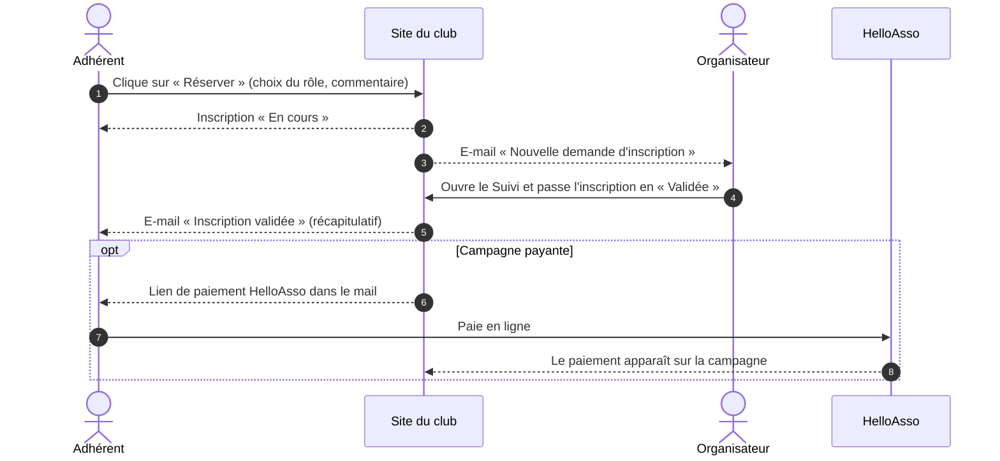

---

## 2. Les statuts d'une inscription

Une inscription passe par quatre statuts. L'adhérent et l'organisateur voient le même état, avec des mots légèrement différents.

| Ce que voit l'organisateur | Ce que voit l'adhérent | Signification |
|---|---|---|
| | Pas d'inscription | Vous n'apparaissez pas dans la liste de l'organisateur |
|  | Inscription en cours de validation | La demande est faite, l'organisateur ne l'a pas encore traitée |
| | Inscription validée | L'organisateur a accepté |
| | Inscription non retenue par le responsable de la campagne | L'organisateur n'a pas retenu la demande. **Statut définitif pour l'adhérent**, qui ne peut plus rien changer ; seul l'organisateur peut revenir dessus |
| 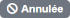 | Annulée | L'adhérent s'est désinscrit alors que son inscription était déjà **validée**. Seule l'oragnisateur peut mettre à jour le status.|

**Non retenue** et **Annulée** sont volontairement distinctes : *Non retenue* est une décision de l'organisateur, *Annulée* est le choix de l'adhérent. Une inscription non retenue **clôt la demande** : l'adhérent n'a plus aucune action possible sur cette campagne, seul l'organisateur peut encore faire évoluer le statut.

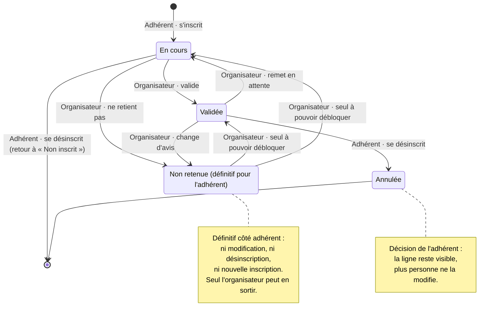

Points à retenir :

- L'organisateur peut **changer un statut à tout moment** (validée ↔ non retenue ↔ en cours).
- Une inscription **non retenue** est **définitive pour l'adhérent** : elle est verrouillée, il ne peut ni la modifier, ni se désinscrire, ni se réinscrire pour repasser en « En cours ». **Seul l'organisateur** peut encore la faire évoluer (vers « Validée » ou « En cours »).
- Une inscription **annulée** par l'adhérent ne peut plus être modifiée par l'organisateur : elle reste visible pour mémoire.
- Un adhérent qui se désinscrit alors que son inscription est **« En cours »** redevient simplement **« Non inscrit »** (aucune trace côté organisateur) et peut se réinscrire quand il veut.
- S'il se désinscrit alors que son inscription était **« Validée »**, elle passe à **« Annulée »** : elle est alors **verrouillée** comme une inscription non retenue, et seul l'organisateur peut la rétablir.

---

## 3. Côté adhérent

### 3.1 Où trouver les campagnes

Sur votre page **Accueil** (espace Adhérents), vous trouvez des encarts repliables (la flèche à gauche du titre permet de les ouvrir ou de les fermer) :

- **Campagnes Formation**
- **Campagnes Loisir**
- **Boutique**

Un encart n'apparaît que s'il y a au moins une campagne ouverte. Une campagne est visible uniquement entre sa date d'ouverture et sa date de fermeture.

### 3.2 S'inscrire

1. Repérez la campagne dans l'encart Formation ou Loisir. Vous y voyez son titre, sa description, ses dates, et un lien vers l'article si l'organisateur en a lié un.
2. Cliquez sur **Réserver**.
3. Dans la fenêtre qui s'ouvre :
   - choisissez votre **rôle** (par exemple *Pratiquant* ou *Encadrant* pour une formation) ;
   - indiquez le **nombre de places** si la campagne le permet ;
   - ajoutez, si vous le souhaitez, un **commentaire** pour l'organisateur (une contrainte, une question, du matériel apporté…).
4. Validez.

Votre inscription apparaît immédiatement avec le statut **« Inscription en cours de validation »**.
Un mail sera ensuite à envoyer à l'organisateur pour l'informer de votre inscription.

À savoir :

- Pour une **Formation**, une seule place par adhérent.
- Pour un **Loisir**, vous pouvez réserver plusieurs places (par exemple pour vous et un invité) **uniquement si l'organisateur a autorisé les places multiples**.
- Le nombre de places affiché est **indicatif** : c'est l'organisateur qui décide en dernier ressort.
- Votre **profil adhérent** doit exister pour pouvoir s'inscrire. Si un message vous l'indique, contactez le secrétariat.

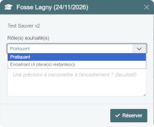

### 3.3 Suivre son inscription

Sur la ligne de la campagne, vous voyez en permanence votre statut :

- **Inscription en cours de validation** (orange) : patientez, l'organisateur a été prévenu.
- **Inscription validée** (vert) : vous êtes accepté. Un e-mail de confirmation vous est envoyé.
- **Inscription non retenue par le responsable de la campagne** (rouge) : la décision est **définitive de votre côté**. Le bouton de modification est **désactivé** (cadenas) et vous ne pouvez plus ni vous désinscrire ni vous réinscrire vous-même. Seul le responsable peut faire évoluer ce statut : contactez-le.

Si vous avez plusieurs places sur des rôles différents, chacune affiche son propre statut (par exemple « Pratiquant ×2 »).

Si la campagne est payante via HelloAsso, un petit **badge de paiement** indique si votre paiement a bien été retrouvé (« payé ») ou non.

### 3.4 Modifier son inscription ou son commentaire

Cliquez sur **Modifier** : vous pouvez changer le nombre de places, le rôle ou votre commentaire. L'organisateur est prévenu de chaque changement.

### 3.5 Se désinscrire

Dans la fenêtre de modification, cliquez sur **Me désinscrire** et confirmez. Si votre inscription était « En cours », vous redevenez **Non inscrit**. Si elle était « Validée », elle passe à **Annulée** (vous ne pouvez plus la modifier vous-même : contactez l'organisateur). Dans les deux cas, l'organisateur en est informé par e-mail.

### 3.6 L'e-mail de validation

Dès que l'organisateur valide votre inscription, vous recevez un e-mail avec :

- le **titre** de la campagne, votre **rôle** et la **date** de l'événement ;
- la **description** et le **lien vers l'article** s'il y en a un ;
- si la campagne est payante sur HelloAsso et que votre paiement n'a pas encore été retrouvé : le **lien pour payer**.

### 3.7 La boutique

L'encart **Boutique** présente les articles en vente : photo, prix et disponibilité.

- **Disponible** : vous pouvez acheter. Si le stock est limité, « Il reste N » est indiqué.
- **Bientôt** : la vente n'est pas encore ouverte.
- **Terminé / épuisé** : l'article n'est plus disponible.

Le bouton **Acheter** (en bas à droite) vous emmène sur la page HelloAsso de la boutique, où se fait le paiement. Le bouton **Rafraîchir** (en haut à droite) met à jour les prix et les stocks.

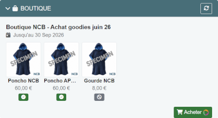

---

## 4. Côté organisateur

Les organisateurs sont les **membres du Bureau** et les **responsables de groupe**. Ils accèdent à la page **Campagnes**, qui comporte trois onglets : **Suivi des inscriptions**, **Gestion des campagnes** et **Récapitulatif formations**.

### 4.1 Onglet « Suivi des inscriptions »

C'est l'écran de travail quotidien : il liste les inscrits d'une campagne.

1. Filtrez la liste des campagnes avec **Toutes / Ouvertes / Fermées** si besoin.
2. Choisissez la campagne dans la liste déroulante.
3. Vous pouvez aussi filtrer par **Rôle** et par **Statut** (voir plus bas).
4. Le tableau affiche, pour chaque inscription : la photo, le nom, les brevets, la **licence** et le **CACI** (l'un au-dessus de l'autre), le **rôle**, le **statut**, la **date de réservation** et le **commentaire** laissé par l'adhérent.

**Filtrer les inscriptions** : deux filtres, **Rôle** et **Statut**, permettent de ne voir que, par exemple, les encadrants « En cours ». Ils se combinent et se remettent à zéro quand on change de campagne.

**Valider ou ne pas retenir** : double-cliquez sur le statut d'une ligne (un petit crayon apparaît au survol), choisissez le nouveau statut dans la liste. C'est enregistré aussitôt.

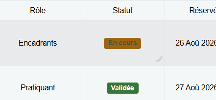

- Quand vous passez une inscription à **Validée**, l'adhérent reçoit automatiquement son e-mail de confirmation (avec le lien de paiement si nécessaire). Vous êtes averti si l'envoi n'a pas pu se faire.

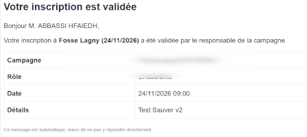

- Repasser plusieurs fois sur « Validée » n'envoie pas de nouvel e-mail.

- Une inscription non retenue est **définitif pour l'adhérent** : il ne peut plus ni se désinscrire ni se réinscrire. **Vous êtes le seul** à pouvoir revenir dessus, en repassant la ligne en « En cours » ou en « Validée ».

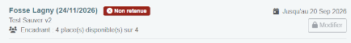

- Les inscriptions **Annulées** par l'adhérent (après validation) sont affichées en gris, en fin de liste. Vous pouvez les rétablir (double-clic, choisir « En cours », « Validée » ou « Non retenue »), ce qui déverrouille l'adhérent.

Cliquer sur le **nom** d'un adhérent ouvre sa fiche ; « Voir tout » affiche tous ses brevets ; cliquer sur le CACI ou la photo les agrandit.

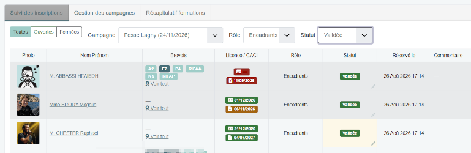

### 4.2 Onglet « Gestion des campagnes »

Permet de:
 - Lister les camapgnes
 - Creer une nouvelle.
 - Modifier une existante.
 - Effacer un campagne close.
 - Ouvrie une campagne à l'inscription.
 - Clore un campagne
 - Avoir un rapport succin des inscriptions.

Dans le tableau pour avec la liste des campagnes :

- le titre, le type (suivi du sous-type pour une formation), les dates (événement, ouverture, fermeture) ;
- la colonne **Places**, détaillée par rôle : ✔ vertes = validées, ⏳ orange = en cours, 👥 = capacité prévue (absente si illimitée). Pour la Boutique : « N/A » ;

- le lien vers l'article
- Un bouton **ouvrir / fermer** et les boutons de **rapport**. 

**Créer ou modifier une campagne** (bouton crayon, ou bouton d'ajout). Le formulaire présente d'abord le **Titre** et le **Type**, puis le **Responsable** et le **Sous-type**, puis la description, les dates, les rôles, etc. :

| Information | Utilité |
|---|---|
| Titre, description | Ce que voient les adhérents |
| Type | Formation, Loisir ou Boutique (non modifiable ensuite) |
| **Sous-type** (Formation uniquement) | Précise la nature de la formation : *Fosse Apnée*, *Fosse Technique 20M*, *Fosse Technique 12M* ou *RIFAx*. Champ facultatif, masqué pour les autres types. Il s'affiche sous le titre dans la liste et sert de filtre dans le récapitulatif |
| Dates d'ouverture et de fermeture | Période pendant laquelle la campagne est visible et ouverte aux inscriptions |
| Date de l'événement | Rappelée dans l'e-mail de validation |
| Places par rôle | Capacité **indicative** de chaque rôle (0 = non défini). Ne soyez pas originale dans les libellés des rôles, car dans la vue récapitulative, ça peut devenir illisible. |
| Places multiples | Autorise un adhérent à réserver plusieurs places (Loisir) |
| Article | Lien vers un article du site, proposé aux adhérents |
| Événement HelloAsso | Relie la campagne à son formulaire HelloAsso (paiement, rapports) |
| **Responsable** | Personne prévenue par e-mail des demandes (Formation et Loisir) |

**Le responsable de campagne** est choisi parmi les membres du Bureau et les responsables de groupe. Il reçoit un e-mail à chaque :

- nouvelle demande d'inscription ;
- modification (nombre de places ou rôle) ;
- désinscription ;
- nouveau commentaire de l'adhérent.

Chaque e-mail indique l'adhérent (nom, licence, téléphone, e-mail), **l'ancien et le nouveau statut** et le commentaire. Sans responsable désigné, aucun e-mail n'est envoyé.

**Ouvrir / fermer** : le bouton se trouve dans la colonne dédiée. Une campagne fermée disparaît du tableau de bord des adhérents.

**Supprimer** : possible uniquement sur une campagne fermée, avec confirmation. La campagne est masquée (les données ne sont pas détruites).

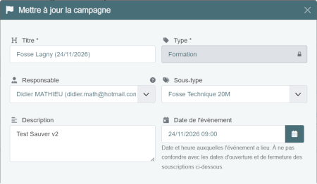
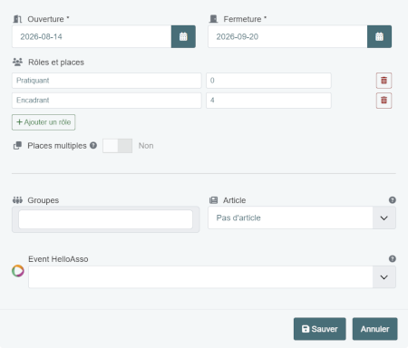

### 4.3 Les rapports

Chaque ligne propose, **seulement s'ils ont un sens**, jusqu'à deux boutons :

-  **Rapport des réservations** (Formation et Loisir) : adhérent, niveau, rôle, date, statut et commentaire. Les inscriptions annulées y figurent mais ne sont pas comptées dans le total.
-  **Rapport HelloAsso** (si la campagne est reliée à HelloAsso) : les paiements reçus. Pour une formation ou un loisir : qui a payé. Pour la boutique : acheteur, article, montant, date.

### 4.4 Onglet « Récapitulatif formations »

Une vue d'ensemble de **toutes les formations** en un seul tableau, pour voir d'un coup d'œil qui a participé à quoi.

- **Une ligne par adhérent** ayant réservé au moins une fois une formation (photo, civilité, nom, prénom ; un clic sur le nom ouvre sa fiche).
- **Une colonne par formation**, avec sa date d'événement.
- À l'intersection : le **dernier statut** de l'adhérent pour cette formation (*En cours*, *Validée*, *Non retenue* ou *Annulée*, avec les mêmes couleurs que dans le Suivi), ou « — » s'il ne s'y est jamais inscrit. Si l'adhérent s'est désinscrit puis réinscrit, c'est son inscription la plus récente qui compte.
- **Filtre Rôle** (sélection multiple) : la liste reprend tous les rôles réellement utilisés (le rôle étant un texte libre, une orthographe différente comme « Encadrant » / « Encadrants » apparaît comme deux choix distincts : cochez-les tous les deux si besoin). Chaque case affiche alors le dernier statut parmi les seuls rôles choisis, et les adhérents sans inscription sur ces rôles disparaissent.
- **Filtre Sous-type** : n'affiche que les formations d'un sous-type (par exemple *Fosse Apnée*) et retire les adhérents qui n'y ont pas réservé. Le filtre n'apparaît que si au moins une formation a un sous-type ; il revient sur « Tous » à chaque ouverture de l'onglet.

Les données sont relues à chaque ouverture de l'onglet : elles sont toujours à jour.

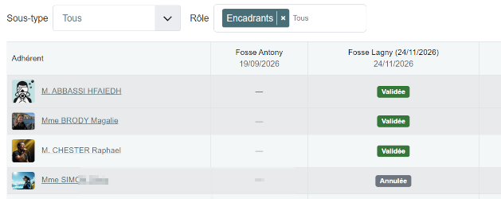

---

## 5. Qui voit quoi, qui fait quoi

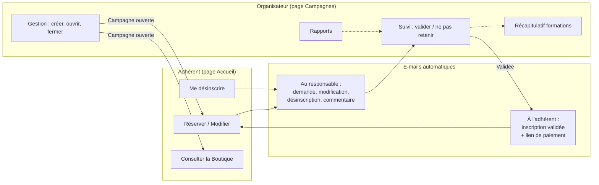

---

## 6. Questions fréquentes

**Je m'inscris : est-ce que ma place est réservée ?**
Non, pas avant la validation. « En cours » signifie que l'organisateur doit encore examiner votre demande.

**Il n'y a plus de places affichées, puis-je quand même m'inscrire ?**
Oui : le nombre de places est indicatif, l'organisateur décide. Afin de pouvoir faire tourner l'effectif, que tout le monde puisse participer aux fosses.

**Mon inscription n'a pas été retenue, que faire ?**
De votre côté, la décision est définitive : vous ne pouvez plus modifier votre inscription, vous désinscrire ni vous réinscrire. Contactez le responsable de la campagne : lui seul peut revenir sur sa décision.

**Je ne vois pas la campagne sur mon Accueil.**
Elle est peut-être fermée ou pas encore ouverte. Vérifiez ses dates auprès de l'organisateur.

**Un adhérent a payé mais le badge n'indique pas « payé ».**
Le rapprochement se fait à partir du numéro de licence saisi lors du paiement HelloAsso. Vérifiez qu'il est exact ; l'organisateur peut consulter le rapport HelloAsso.

**J'ai reçu un message « Votre session a expiré ».**
Rechargez la page (F5), reconnectez-vous si besoin, puis recommencez.
